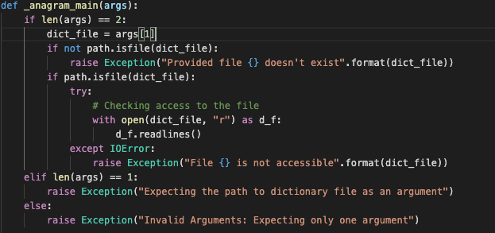
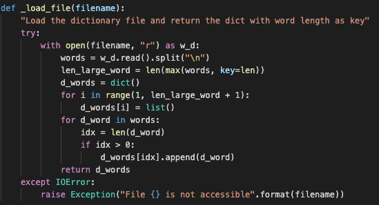
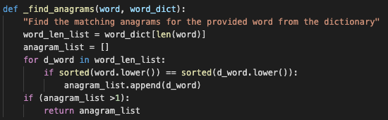
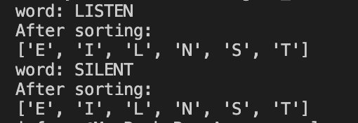
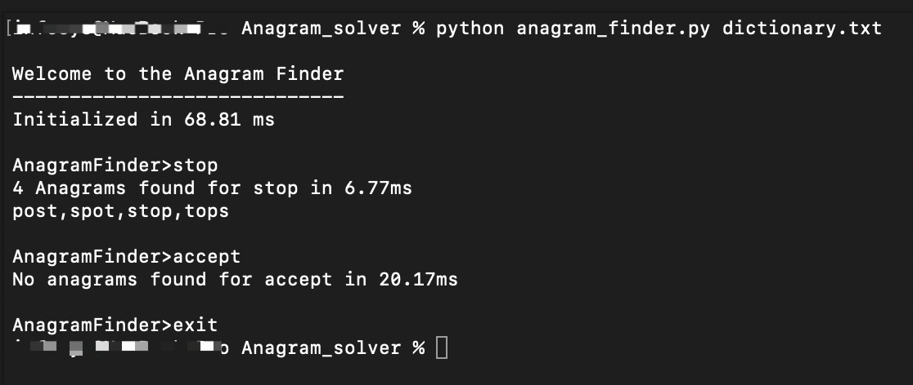
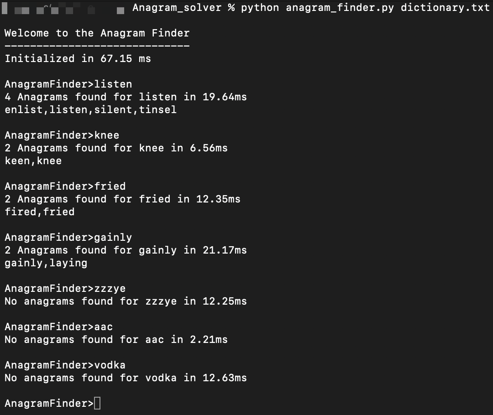
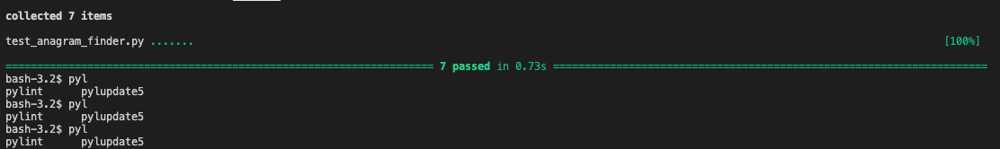
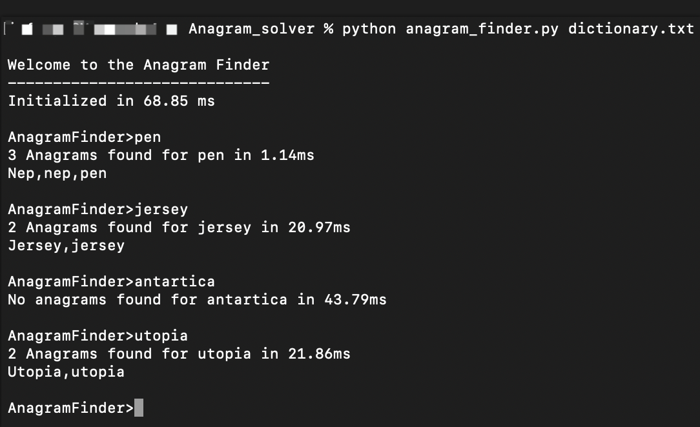

# Anagram Finder
 Anagram - A word formed by rearranging the letters of another.
 
 Eg - 'Heart' can be formed from 'earth'.

 Algorithm to find all the anagrams found in the given dictionary file for the given word.

 ## Table of Contents
 * Introduction
 * Steps to Execute the code 
 * Algorithm/ Code
    * Scope of the funtions
 * Input and Output
    
    *  Illustration of sample i/p & o/p
 * Testing
    * Illustration of Test cases
 * Further Improvements

 * Performance 
 * Time taken for the project

 ### Introduction

This simple Anagram finder program is written in Python3. For implementation only built-in modules are used to solve the problem. In unit test Pytest module is imported for testing purposes.

### Steps to execute

main code - 'anagram_finder.py' 

source dictionary - 'dictionary.txt'

To run - 

* python anagram_finder.py dictionary.txt

Note - Make sure the source dictionary file is in same directory as source code or else mention the file path to the source dictionary

* python anagram_finder.py $FILEPATH/FILENAME

To run the testing file -

Notes - Make sure you have pytest installed 

* pytest test_anagram_finder.py

### Algorithm/Code

Our main code is in 'anagram_finder.py' file. 

The code checks for the anagrams in the 'dictionary.txt' for the given user input.

#### Scope of the Functions

There are mainly three functions involved for solving

  * _anagram_main(args) - Getting user input at prompt, validating the access to dictionary file and keep prompting until the user enters exit.

  * _load_file(filename) - Load the dictionary file and return the dict with word length as key

  * _find_anagrams(word, word_dict) - Find the matching anagrams for the provided word from the dictionary

##### _anagram_main(args)

When the source dictionary file is parsed to the main function, the path of the file should me mentioned

Ex- source/dictionary.txt

Otherwise if the file is in same directory then we could just give the name of the source

If both the cases are not there, it cannot find the file and it throws an exception that the file cannot be found.

If the file is found, we need to make sure whelther we have the permission to access the file, if not an exception is thrown i.e file not accessible.

##### _load_file(filename)

In this function, I'm reading every line from the source dictionary file and according to the length of the each word they are stored as key values pair.

Key - Length of the word
Value - List of the words with the same length

Ex - '4' : [stop,post,meat,tops,well,eyes,...]

By doing this we can mainly achieve two kinds of optimization.

1. Only the words with same length of user input is taken into consideration, which reduces the time taken to find the matching words.

2. You dont want to loop through the entire file for each user input, we dont want to go through the complete list of words in the dictionary file.

##### _find_anagrams(word, word_dict)

This function gets two arguments one is user input and a list of words from dictionary matching the length of the word user entered.

I'm sorting both the words after converting them to lowercase and if the sorted list is equal, them we know that the word is an anagram for the given word.

Ex - 

#### Imput and Output

##### Illustration of sample I/P & O/P

#### Testing 

A good code always needs testing. 

Following are the scenarios tested through unit tests:

1. Whether _load_file module returns dictionary

2. Whether exception is thrown correctly when file is not    accessible

3. Whether anagrams are found properly

4. Whether anagrams are not returned for invalid text

5. Whether missing argument exception is raised

6. Whether additional arguments exception is raised

7. Whether file not available exception is raised

#### Further improvements

Here the input pen has repeated its anagram, because the source dictionary file has words as Pen and pen, so our algorithm considers it as two different words.

This can be handled in two ways: 
1. Adopt the code to be case insensitive and return only one anagram output.
2. Clean up the source dictionary to avoid the duplicates.

When I'm adding the words to the list in the dictionary based on the length of the word it's getting appended in the same order it's available in dictionary file, hence words starting with letters like z might take a bit more time. This can be improved by randomizing the list or ordering the list based on the words which has most frequently used characters.

#### Performance 

Performance is a main factor determines a better algorithm.

Here as per my program, when the program is initiatized, the load time might be a bit high but for every user request it will be much faster. I decide to compromise a little on my inital load to give a better performance for the every user input.

#### Time taken for the project

* Anagram Finder - approx 5 hrs
* Unit Testing - approx 4 hrs
* Documentation - approx 4 hrs

    

